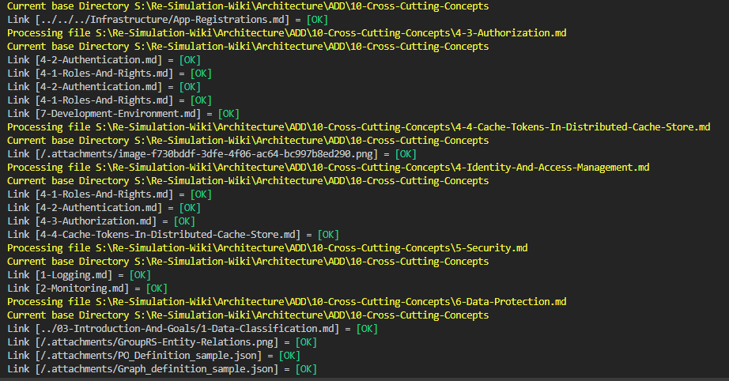

## Getting started

1. For example, pull the Demo-Wiki to <path>\Demo-Wiki.
2. `cd src\CheckMarkdownLinks.Console`
3. `dotnet build`
4. `dotnet run -- -i  <path>\Demo-Wiki`

output will be similar to:
<todo/> <!---->

## Run tests

1. `cd tst\CheckMarkdownLinks.Tests`
2. `dotnet test`

## Install as dotnet tool

- `dotnet tool install CheckMarkdownLinks --version 1.0.1-alpha`

## Open Issues

- [x] add build.cmd for easy build
- [ ] additional tests
- [ ] Support for additional markdown extension such ask *.markdown
- [ ] Decent checking of web URL with correct return code.
- [ ] Checking of document anchor links
- [x] add verbose flag
- [ ] Github action to build and publish package
- [ ] False positives happen due to cae insensitive `File.Exists` check. Can probable be done with a `PInvoke` on [FindFirstFileEx](http://www.pinvoke.net/default.aspx/kernel32/findfirstfileex.html)
